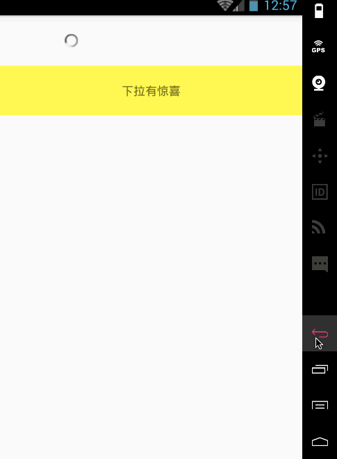

# ReactNativePullToRefreshSample

react native下拉刷新

* android

    基于[android-Ultra-Pull-To-Refresh](https://github.com/liaohuqiu/android-Ultra-Pull-To-Refresh)封装的react native下拉刷新组件
    
* ios
    
    暂用`RefreshControl`，缺点是不能在释放手指的时候再刷新，估计还得自己再封装一个。

## Why

react native内置的`RefreshControl`不能满足需求

github上一些js only的下拉刷新组件，比如`react-native-swRefresh`等，在android上体验比较差

## ScreenShots

* android

    
    
* ios

    待续...

## TODO

* 自定义header
